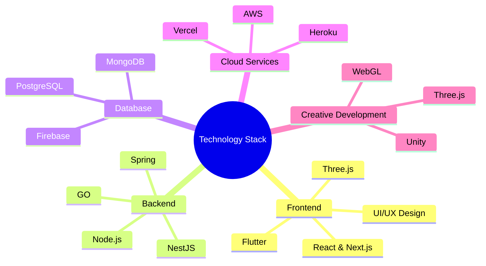

<div align="center">

# Fabian Amino
## Full Stack Developer | Creative Technologist

[](https://www.linkedin.com/in/fabian-amino-b6bba5253/)
[](https://www.aminofabian.com/)
[](https://twitter.com/amino_fabian)
[](https://www.medium.com/@aminofabian/)

</div>

## About Me

Full Stack Developer based in Nairobi, Kenya, specializing in innovative web solutions and interactive experiences. I combine technical expertise with creative problem-solving to build engaging digital products.

```python
class Developer:
    def __init__(self):
        self.name = "Fabian Amino"
        self.role = "Full Stack Developer"
        self.location = "Nairobi, Kenya"
        self.expertise = [
            "Web Development",
            "Mobile Applications",
            "3D Web Experiences",
            "Interactive Design"
        ]
        self.current_focus = "Building immersive web experiences with Three.js"

    def get_tech_stack(self):
        return {
            "Frontend": ["React", "Next.js", "Three.js", "Flutter"],
            "Backend": ["Node.js", "NestJS", "Spring", "GO"],
            "Database": ["MongoDB", "PostgreSQL", "Firebase"],
            "Cloud": ["AWS", "Heroku", "Vercel"],
            "Tools": ["Git", "Docker", "Figma", "Unity"]
        }
```

## Technical Expertise



## Current Projects

- 🎨 Developing immersive 3D web experiences using Three.js
- 🚀 Building scalable enterprise applications with Next.js
- 📱 Creating cross-platform mobile applications with Flutter
- 🎮 Exploring game development with Unity

## GitHub Analytics

<div align="center">

[](https://github.com/aminofabian)
[](https://github.com/aminofabian)

</div>

## Let's Connect

- 📧 Professional Inquiries: hello@aminofabian.com
- 💼 LinkedIn: [Fabian Amino](https://www.linkedin.com/in/fabian-amino-b6bba5253/)
- 🌐 Portfolio: [aminofabian.com](https://www.aminofabian.com)

---

<div align="center">
<i>Passionate about creating meaningful digital experiences and solving complex problems through code.</i>
</div>
