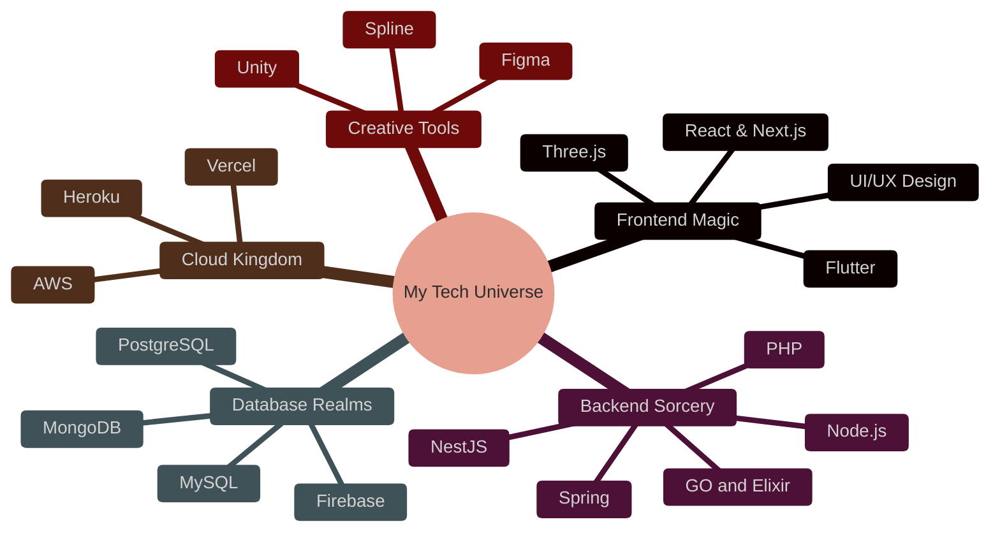

<div align="center">
  
```ascii
 ╔══════════════════════════════════════════════════════════════╗
 ║                                                              ║
 ║   ███████╗ █████╗ ██████╗ ██╗ █████╗ ███╗   ██╗            ║
 ║   ██╔════╝██╔══██╗██╔══██╗██║██╔══██╗████╗  ██║            ║
 ║   █████╗  ███████║██████╔╝██║███████║██╔██╗ ██║            ║
 ║   ██╔══╝  ██╔══██║██╔══██╗██║██╔══██║██║╚██╗██║            ║
 ║   ██║     ██║  ██║██████╔╝██║██║  ██║██║ ╚████║            ║
 ║   ╚═╝     ╚═╝  ╚═╝╚═════╝ ╚═╝╚═╝  ╚═╝╚═╝  ╚═══╝            ║
 ║                                                              ║
 ╚══════════════════════════════════════════════════════════════╝
```

[](https://git.io/typing-svg)


</div>


## <span style="color: #d5573c">🎮 Quick Start Guide</span>

```python
class FullStackDeveloper:
    def __init__(self):
        self.name = "Fabian Amino"
        self.role = "Full Stack Developer"
        self.location = "Nairobi, Kenya 🌍"
        self.languages = {
            "Python": "🐍",
            "JavaScript": "⚡",
            "Dart": "🎯",
            "Java": "☕"
        }
        self.challenge = "Building a game in Unity"
        self.fun_fact = "I can code with my eyes closed... just kidding! 😄"
    
    def say_hi(self):
        print("Thanks for dropping by! Let's create something amazing together!")

me = FullStackDeveloper()
me.say_hi()
```

## <span style="color: #f39409">🎨 Art Gallery (Skills & Tools)</span>

<div align="center">

[](#)
[](https://reactjs.org/)
[](https://nextjs.org/)
[](https://threejs.org/)
[](https://flutter.dev/)



</div>

## <span style="color: #6d2431">🌟 Achievement Unlocked</span>

<div align="center">

| 🏆 Achievements | 🎯 Current Quests |
|----------------|-------------------|
|  |  |

</div>

## <span style="color: #653545">🎵 Currently Playing With</span>

<table>
  <tr>
    <td width="50%" align="center">
      
      <br>
      <h3 style="color: #0288f3">🎮 Game Development</h3>
      <p>Learning Unity & Building Interactive Experiences</p>
    </td>
    <td width="50%" align="center">
      
      <br>
      <h3 style="color: #d5573c">🌌 3D Web Experiences</h3>
      <p>Crafting Immersive Interfaces with Spline & Three.js</p>
    </td>
  </tr>
</table>

## <span style="color: #676a83">📊 Player Stats</span>

<div align="center">
  
```ascii
Level 3 Full Stack Developer
XP: ███████████████░░░░░ 78%
```


</div>

## <span style="color: #0288f3">🌐 Multiplayer Zone</span>

<div align="center">

[](https://www.linkedin.com/in/fabian-amino-b6bba5253/)
[](https://twitter.com/amino_fabian)
[](https://www.aminofabian.com/)
[](https://www.medium.com/@aminofabian/)

</div>

## <span style="color: #d5573c">🎮 Start New Game (Contact)</span>

<div align="center">

```ascii
⌨️  hello@aminofabian.com  🎮  aminofabian@gmail.com
```

<details>
<summary style="color: #0288f3">🎲 Random Fun Facts</summary>
<br>
  
- 🎮 I dream in code and debug in my sleep
- 🌟 I can turn coffee into code with 99.9% efficiency
- 🚀 I believe every bug is just an undocumented feature
- 🎨 I speak fluent HTML, CSS, and Meme
- 🌈 My favorite HTTP status code is 418 (I'm a teapot)
  
</details>

---


```ascii
PRESS START TO COLLABORATE
```

</div>
